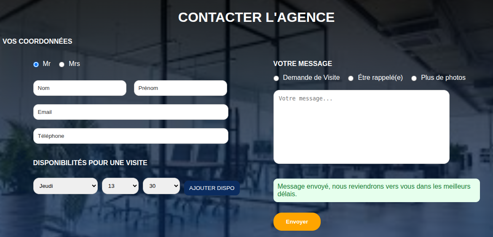
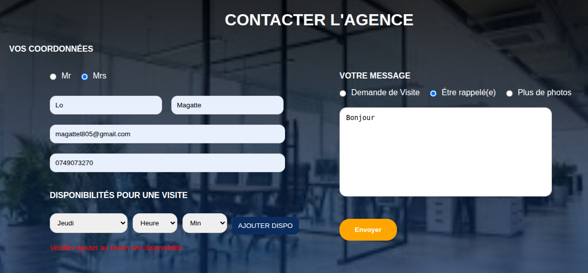

# À propos de moi

Je m'appelle Magatte Lo, étudiante en Master 2 MIASHS – parcours Web Analyste à l'Université de Lille.

Je suis actuellement à la recherche d’un stage de 4 à 6 mois, réalisable entre mai et octobre, et je suis disponible immédiatement.


# Aperçu du formulaire

### 1. Formulaire vide


### 2. Validation des erreurs (champs obligatoires)


### 3. Message de succès après envoi


### 4. Ajout des disponibilités


### 5. Erreur si aucune disponibilité n’est ajoutée



# Stack technique & choix

### Frontend
- **React (Vite)** : framework utilisé pour construire une interface utilisateur rapide, moderne et réactive.
- **useState (React Hooks)** : permet de gérer l’état du formulaire (données, erreurs, succès).
- **Fetch API** : utilisée pour envoyer les données du formulaire vers le backend.

### Backend
- **Node.js** : environnement d’exécution JavaScript côté serveur.
- **Express.js** : framework utilisé pour créer l’API et gérer la route POST /form.
- **CORS** : permet la communication entre le frontend (React) et le backend (Express).
- **fs (File System)** : utilisé pour stocker les données dans un fichier JSON (simule une base de données).

### Outils
- **JSON local (data.json)** : stockage simple des données du formulaire sans base de données réelle.


# Lancement du projet

### 1. Cloner le projet

```bash
git clone https://github.com/Magatte805/test_majordhom.git
cd formulaire-contact
```
### 2. Installation et lancement du frontend (React)

```bash
npm install
npm run dev
```
### 3. Installation et lancement du backend (Express)

```bash
cd server
npm install
node index.js
```
### 4. Accès au projet

Frontend : http://localhost:5173 (ou port affiché par Vite)
backend : http://localhost:5000


# Questions

### Avez-vous trouvé l’exercice facile ou difficile ? Qu’est-ce qui vous a posé problème ?
L’exercice était intéressant à réaliser. C’est un type d’exercice que nous avons déjà rencontré dans nos projets, donc il n’était pas trop difficile à mettre en place.

### Avez-vous appris de nouveaux outils pour répondre à l’exercice ? Si oui, lesquels ?
Oui, j’ai appris à mieux utiliser Express.js, que nous avions déjà vu en licence mais que j’ai approfondi dans ce projet. J’ai également mieux compris la structure d’une API et la gestion des données entre React et Node.js.

### Quelle est la place du développement web dans votre cursus de formation ?
Je suis en Master MIASHS parcours Web Analyst. Mon cursus combine à la fois le développement web et l’analyse de données. Nous avons des cours orientés développement web, notamment la création de sites avec React côté frontend, mais aussi du backend avec Symfony (PHP). J’ai également fait une licence en développement full-stack où j’ai appris HTML, CSS, JavaScript et Python. Le développement web occupe donc une place importante dans mon parcours.

### Avez-vous utilisé un LLM ? Si oui, comment intégrez-vous les LLM à chaque étape de votre workflow ?
Oui, j’ai utilisé un LLM comme outil d’assistance. Il m’a aidé à structurer certaines parties du code, comprendre des erreurs et accélérer le développement. Je l’utilise comme un support de travail pour gagner en efficacité, tout en m’assurant de comprendre et d’adapter chaque partie du code moi-même avant intégration.
